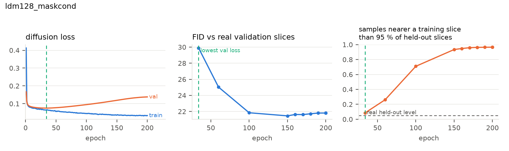
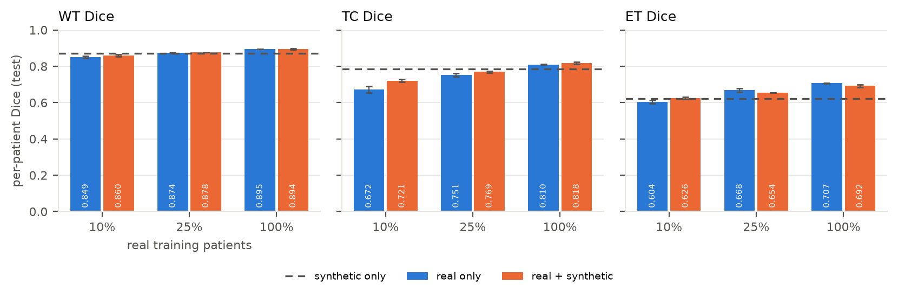

# SynthMRI — latent diffusion for synthetic multi-modal brain-tumour MRI

Research code for generating synthetic 2-D brain-tumour MRI slices (FLAIR / T1ce / T2) from the
BraTS 2020 training set with a **latent diffusion model** (LDM): a frozen, pretrained Stable Diffusion
VAE compresses each slice 8× into a 4-channel latent, and a small U-Net learns to denoise in that
latent space. A **mask-conditioned** variant generates paired (image, tumour-mask) data, which is
evaluated by whether it improves a downstream tumour segmenter.

```
BraTS 2020 3-D volumes ──preprocess──▶ 2-D tumour slices (patient-level train/val/test)
        │                                          │
        │                       frozen SD-VAE ─encode─▶ cached latents (+ flips)
        │                                          │
        │                       latent U-Net ◀──train──┘   (optional mask conditioning, CFG, EMA)
        ▼                                          │
   real test slices ◀──── evaluate ────── sample ──┘  DDIM/DDPM  ──▶ synthetic (image, mask) pairs
   FID / KID / SSIM-diversity / memorisation / VAE ceiling                │
                                                                          ▼
                                            2-D U-Net segmenter: real vs real+synthetic (Dice WT/TC/ET)
```

## Results at a glance (2026-09-10; full write-up in [docs/RESULTS.md](docs/RESULTS.md))

* **Memorisation, not quality, limits training length.** The unregularised 128 px model copies 97 %
  of its samples from training slices by epoch 200 while its FID keeps improving; every reported
  number therefore comes from the lowest-validation-loss checkpoint, chosen on validation patients only.
* **Affine latent augmentation (+ dropout) fixes it**: FID vs test 20.85 instead of 26.22 at 128 px,
  memorised fraction 0.04. At 256 px the same recipe reaches FID 10.45, next to the 9.55 that two sets
  of *real* slices score against each other.
* **Downstream tumour segmentation (2-D U-Net, per-patient Dice, 3 seeds).** At 128 px, mixing
  synthetic pairs into training hurts TC/ET; the frozen Stable Diffusion VAE alone reproduces that loss
  (real slices passed through it lose 0.06–0.07 mean Dice), so the decoder's blur is the bottleneck.
  At 256 px, where the VAE ceiling is 2.6 dB higher, synthetic data *helps* with 26 real patients
  (+0.027 mean Dice, all regions, 3/3 seeds) and is neutral with more. Used for pre-training instead,
  synthetic data helps at 128 px too: +0.021 at 10 % real and +0.014 at 25 % over a control given
  the same extra epochs on real data.
* **Fine-tuning only the VAE decoder on the training slices** (encoder, latents and diffusion model
  untouched) raises the 128 px ceiling from 26.4 to 27.8 dB (SSIM 0.833 → 0.883) and, decoding the
  *same* latent samples again, cuts the per-modality FIDs by 35–75 % (T2 69.6 → 17.6) while the
  composite 3-channel FID stays at 20.9. It recovers only about a third of the segmentation loss
  (10 % real: −0.031 → −0.020; 100 %: −0.021 → −0.012; ET still −0.06 to −0.08), so the blur was
  part of the problem, not most of it. The secondary analyses with the new decoder are pending.

|  |  |
|---|---|
| baseline: validation loss, FID and copied fraction per epoch | 256 px: Dice with and without synthetic slices |

**Status.** Complete: all diffusion models, checkpoint curves, model selection, 128 px and 256 px
segmentation studies, secondary analyses and the compute-matched pre-training control. Running (see
[docs/EXPERIMENTS.md](docs/EXPERIMENTS.md) for the pre-declared protocol): the VAE-decoder fine-tune
study (decoder trained, samples re-decoded and scored, primary segmentation protocol repeated; its secondary analyses are pending). A PDF of the results with all figures is
[docs/SynthMRI_results.pdf](docs/SynthMRI_results.pdf) (`python scripts/make_report.py`).

## Setup

```bash
conda env create -f environment.yml   # or: pip install -r requirements.txt && pip install -e .
conda activate synthmri
pytest                                # CPU-only unit tests, ~1 min, no data or downloads needed
```

The exact package versions used for the reported runs are in `requirements-lock.txt`.

## Data

Download the BraTS 2020 training data (Kaggle `awsaf49/brats20-dataset-training-validation`) and
point `data.raw_dir` at the folder containing the `BraTS20_Training_XXX` patient directories
(default: `data/raw/BraTS2020/BraTS2020_TrainingData/MICCAI_BraTS2020_TrainingData`). Then

```bash
python scripts/preprocess.py --config configs/ldm128_maskcond.yaml   # 128 px  (~1.5 min, 20 workers)
python scripts/preprocess.py --config configs/ldm256_maskcond.yaml   # 256 px  (~2 min)
```

This writes per-split arrays under `data/processed/brats{128,256}/{train,val,test}/` and reuses the
committed patient split `splits/brats2020_patient_splits.json` (258 / 37 / 74 patients). See
[docs/DATA.md](docs/DATA.md) for the preprocessing details and dataset statistics.

## Train, sample, evaluate

```bash
export CUDA_DEVICE_ORDER=PCI_BUS_ID CUDA_VISIBLE_DEVICES=0

python scripts/train.py    --config configs/ldm128_maskcond.yaml          # or ldm128_uncond / ldm256_*
python scripts/sample.py   --run runs/ldm128_maskcond --num_images 5000 --guidance_scale 2.0   # best-val-loss weights
python scripts/evaluate.py --run runs/ldm128_maskcond --samples runs/ldm128_maskcond/samples_best_ddim50_cfg2_seed0
python scripts/checkpoint_curve.py --run runs/ldm128_maskcond                                    # FID/memorisation per checkpoint
python scripts/sample.py   --run runs/ldm128_maskcond --num_images 5000 --guidance_scale 2.0 --mask_source val   # unseen (validation) masks
python scripts/select_model.py runs/ldm128_maskcond runs/ldm128_maskcond_do01 runs/ldm128_maskcond_reg   # validation-only choice of the main recipe
python scripts/train_seg.py --config configs/ldm128_maskcond.yaml --out runs/seg/real100_s0            # real only
python scripts/train_seg.py --config configs/ldm128_maskcond.yaml --real_fraction 0.1 \
    --synthetic runs/ldm128_maskcond/samples_best_ddim50_cfg2_seed0 --out runs/seg/real010_synth_s0
```

Any config value can be overridden on the command line with dotted keys, e.g.
`python scripts/train.py --config configs/ldm128_uncond.yaml train.epochs=50 train.batch_size=32`.
`configs/smoke.yaml` runs the whole pipeline for 30 steps as a check. `scripts/run_experiments.sh`
reproduces the full set of experiments in [docs/EXPERIMENTS.md](docs/EXPERIMENTS.md) (the `_reg`
configs add U-Net dropout and cached affine augmentation, `train.augment`); results are collected in
[docs/RESULTS.md](docs/RESULTS.md).

Each run directory contains `config.yaml`, `run_info.json` (git commit, versions), `metrics.csv`,
TensorBoard logs (`tb/`), periodic sample sheets (`samples/`), epoch checkpoints, `best/` (lowest
validation loss, EMA weights; the default for sampling, see `--checkpoint`) and `final/`.

## Documentation

| file | contents |
|---|---|
| [docs/RESULTS.md](docs/RESULTS.md) | all results with interpretation; every number traceable to a run directory |
| [docs/results_tables.md](docs/results_tables.md) | auto-generated tables (`scripts/collect_results.py`), also `results/summary.json` |
| [docs/EXPERIMENTS.md](docs/EXPERIMENTS.md) | protocol, model-selection rule, and the pre-declared follow-up studies with their reading rules |
| [docs/REPRODUCE.md](docs/REPRODUCE.md) | commands, queue scripts and timings to reproduce everything on one GPU |
| [docs/DATA.md](docs/DATA.md), [docs/ARCHITECTURE.md](docs/ARCHITECTURE.md) | preprocessing and dataset statistics; pipeline design decisions |
| [docs/CHANGES.md](docs/CHANGES.md) | dated work log |
| [docs/figures/](docs/figures) | every figure referenced above (PNG) |

## Repository layout

```
synthmri/
  config.py             typed YAML config with _base_ inheritance and dotted CLI overrides
  data/                 BraTS discovery (brats.py), patient splits, preprocessing, datasets
  models/               frozen VAE wrapper (+ test double), U-Net factory
  diffusion/            latent caching, conditioning, schedulers, training loop, sampling, checkpoints
  eval/                 VAE reconstruction, FID/KID, diversity & memorisation, downstream segmentation
  utils/                seeding, I/O, logging, figures
scripts/                preprocess / train / sample / evaluate / checkpoint_curve / train_seg / finetune_vae_decoder /
                        select_model / collect_results / make_figures / make_report / run_experiments.sh / queue_*.sh
configs/                base.yaml + experiment configs + smoke.yaml
tests/                  pytest suite on a synthetic mini-BraTS (no downloads)
splits/                 committed patient-level split
docs/                   ARCHITECTURE, DATA, EXPERIMENTS, RESULTS, CHANGES (work log)
notebooks/              legacy exploratory notebook (superseded by the package)
```

## Notes

* Only one compute GPU is needed; a full 128-px run trains in 1.5 h on an RTX A6000 (256 px: 2.8 h).
* The three modalities are mapped onto the VAE's RGB channels, so exactly three modalities are used.
  T1 is preprocessed and stored as well (`MODALITIES = (flair, t1, t1ce, t2)`) for future work.
* `docs/CHANGES.md` is the dated work log for this repository.
