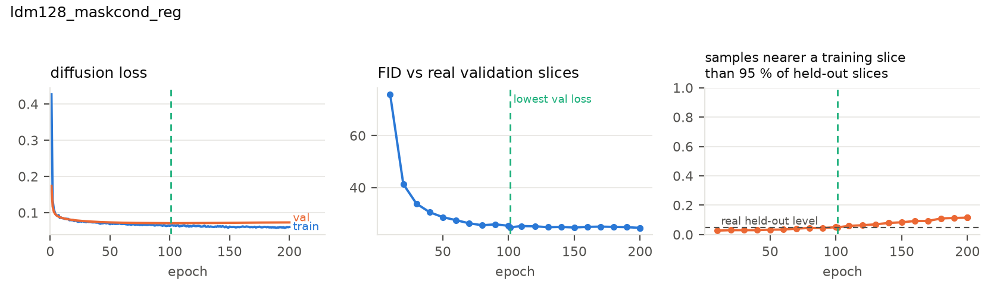
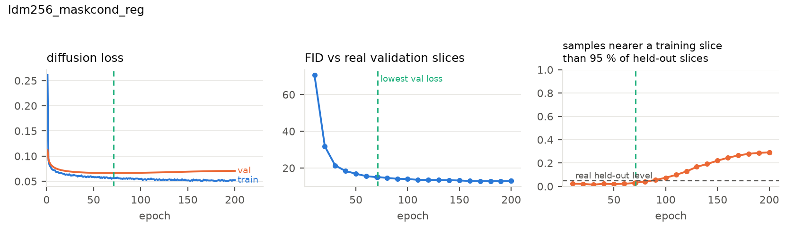
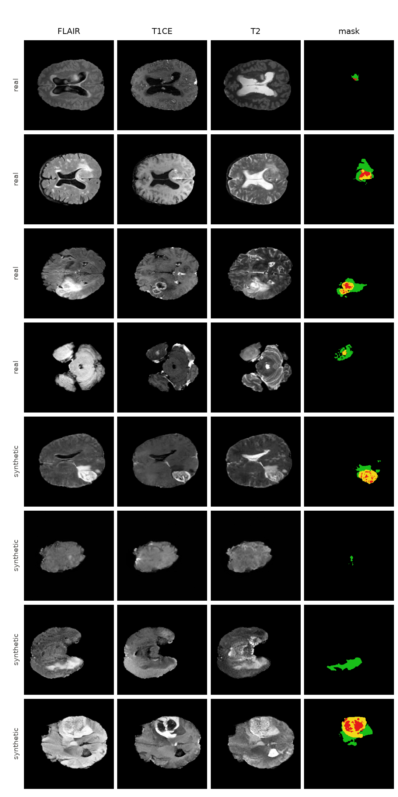
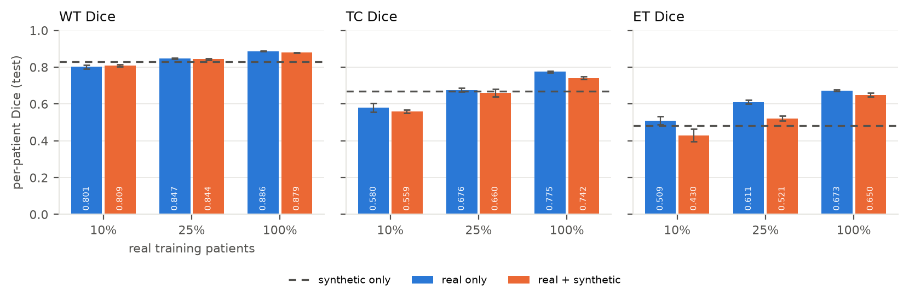
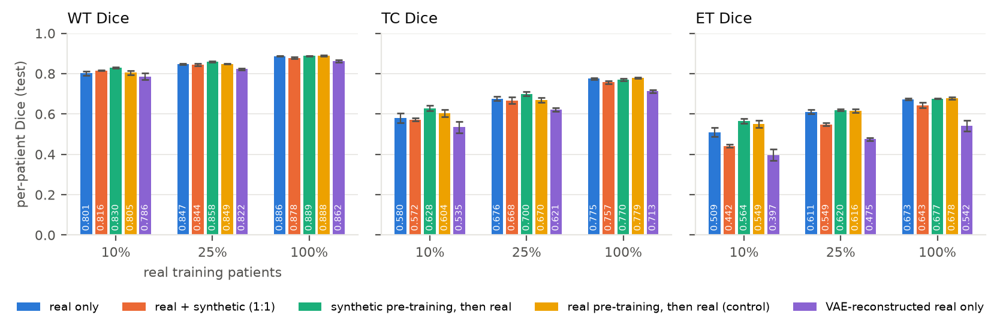
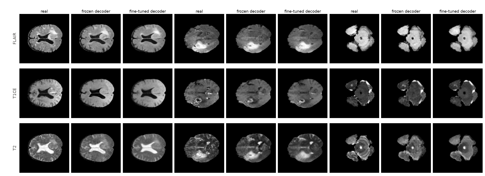

# Results

Every number below is copied from [results_tables.md](results_tables.md) / `results/summary.json`,
which `scripts/collect_results.py` regenerates from the run directories under `runs/`
(protocol: [EXPERIMENTS.md](EXPERIMENTS.md); data: [DATA.md](DATA.md)). Generation metrics use the
`best/` weights (lowest validation diffusion loss, EMA) and 5,000 DDIM-50 samples unless stated;
segmentation Dice is per-patient on the 74 held-out test patients, mean ± std over 3 seeds.

Status (2026-09-10 20:30): the diffusion models, the checkpoint curves, the model selection, the
128 px segmentation study with its secondary analyses and the pre-training control, and the 256 px
segmentation study are complete. The pre-declared VAE decoder fine-tune study (section 7) is
running: the decoder is trained and its ceiling measured (7.1); the re-decoded sample scores (7.2)
and the repeated segmentation study (7.3, ≈ 8 h) are marked *pending*.

## Headline findings

1. **Without regularisation the latent diffusion model memorises.** LDM-128-mask reaches its lowest
   validation loss at epoch 34; by epoch 200 its FID against real validation slices has improved from
   29.9 to 21.8, but 97 % of its samples then lie closer to a training slice (either orientation)
   than 95 % of real held-out slices do. The "better" late checkpoints are copies.
2. **Cached affine augmentation, not dropout, fixes this.** With dropout 0.1 + 6 augmented latent
   variants per slice (LDM-128-mask-reg) the validation loss keeps falling to epoch 101, the
   memorised fraction at the last epoch is 0.115 instead of 0.966, and the early-stopped model is
   the best of the three candidates on validation data (FID 24.7 vs 28.8 / 29.9). Dropout alone
   changes nothing (0.891 memorised at epoch 200). The selection was made on validation slices only.
3. **At 256 px the regularised model is near the resolution's floor.** LDM-256-mask-reg: FID 10.45
   vs the real test slices, where two disjoint sets of *real* slices (val vs test) score 9.55;
   memorised 0.030; 10.83 with tumour masks of patients it never saw.
4. **Mixing synthetic slices into training did not improve the 128 px tumour segmenter.** Adding
   patient-matched synthetic pairs raises whole-tumour Dice slightly at 10 % real data
   (0.801 → 0.809) but lowers tumour-core and enhancing-tumour Dice at every data fraction (ET at
   10 %: 0.509 → 0.430; mean Dice at 100 %: 0.778 → 0.757). A segmenter trained on synthetic data
   alone reaches 0.660 mean Dice, about the level of 10 % real data.
5. **The loss is the frozen VAE's, not the diffusion model's.** Real slices merely passed through the
   frozen VAE (no generator) cost more Dice than the synthetic slices do (−0.057 to −0.072 mean,
   ET −0.11 to −0.14), and halving the synthetic ratio barely helps. The natural-image decoder
   removes enhancing-tumour detail; every synthetic image inherits that.
6. **Used as pre-training instead of as extra training data, the synthetic pairs help when real data
   is scarce, even against a compute-matched control**: +0.021 mean Dice at 10 % real and +0.014 at
   25 % over a segmenter given the same extra epochs on real data (raw gains over real only: +0.044
   and +0.015); nothing at 100 %.
7. **At 256 px, where the generator sits at the FID floor and the VAE ceiling is 2.6 dB higher, the
   mixed synthetic data helps in the low-data regime**: +0.027 mean Dice with 26 real patients
   (all regions, 3/3 seeds), neutral with 64 and with all 258. Synthetic-only training reaches the
   level of 25 % real data.

## 1. Memorisation vs training length (checkpoint curves)

2,000 samples per saved checkpoint, fixed masks and seeds; FID against the real *validation*
slices; "memorised" = fraction of samples closer to a training slice (both orientations) than 95 %
of real held-out slices are. Figures: `figures/<run>_checkpoint_curve.png`
(loss / FID / memorised fraction per epoch).

| run | best epoch (val loss) | FID val at best | memorised at best | FID val at epoch 200 | memorised at epoch 200 |
|---|---|---|---|---|---|
| LDM-128-mask (baseline) | 34 | 29.89 | 0.086 | 21.81 | **0.966** |
| LDM-128-mask-do0.1 | 41 | 28.82 | 0.093 | 21.99 | **0.891** |
| LDM-128-mask-reg | 101 | 24.65 | 0.049 | 24.43 | 0.115 |
| LDM-128-reg (unconditional) | 116 | 24.81 | 0.040 | 23.20 | 0.051 |
| LDM-256-mask-reg | 71 | 15.10 | 0.033 | 12.94 | 0.291 |

The FID-vs-epoch curve alone would favour the last checkpoint of every run; the nearest-neighbour
check shows that the FID gain after the validation-loss minimum is bought with copies. Reporting
from the best-validation-loss checkpoint is therefore the protocol for everything below. Even the
regularised 256 px model starts copying after epoch ≈ 90 (0.074 at epoch 100, 0.291 at epoch 200),
so early stopping stays necessary; augmentation postpones memorisation, it does not remove it.

## 2. Regularisation ablation and model selection (validation data only)

Rule fixed before the runs finished: lowest FID against validation slices at the best-val-loss
checkpoint, among candidates with memorised ≤ 0.15 (`results/model_selection.json`).

| candidate | best epoch | FID val ↓ | KID val ×10³ ↓ | memorised ↓ |
|---|---|---|---|---|
| baseline (flips only) | 34 | 29.89 | 18.18 | 0.086 |
| + dropout 0.1 | 41 | 28.82 | 17.24 | 0.093 |
| + dropout 0.1 + affine augmentation **(chosen)** | 101 | **24.65** | **12.86** | **0.049** |

The chosen recipe was then reused unchanged for the unconditional (LDM-128-reg) and the 256 px
(LDM-256-mask-reg) models, and its 20,000-sample pool feeds the segmentation study.

## 3. Generation quality on the test set

Against all 4,623 real test slices. `cfg` = classifier-free guidance scale; `val masks` = samples
conditioned on masks of validation patients (tumour shapes never seen in training). Reference
floor: FID between real validation and real test slices = 10.49 (128 px) / 9.55 (256 px).
Pair-SSIM is the mean SSIM of 2,000 random sample pairs (lower = more diverse; real test slices
0.652 / 0.690). Side-by-side sheets: `figures/<run>_<samples>_real_vs_synth.png`.

| model | setting | FID rgb ↓ | KID ×10³ ↓ | FID flair / t1ce / t2 | pair-SSIM | memorised ↓ |
|---|---|---|---|---|---|---|
| LDM-128-mask (baseline) | cfg 2 | 26.22 | 20.89 | 45.9 / 45.4 / 73.0 | 0.576 | 0.069 |
| LDM-128-mask-do0.1 | cfg 2 | 24.34 | 19.13 | 47.7 / 46.2 / 75.7 | 0.585 | 0.070 |
| LDM-128-mask-reg | cfg 2 | 20.85 | 15.19 | 44.3 / 44.0 / 69.6 | 0.584 | 0.043 |
| LDM-128-mask-reg | cfg 1 | 20.37 | 14.74 | 47.0 / 44.2 / 69.4 | 0.586 | 0.036 |
| LDM-128-mask-reg | cfg 2, val masks | 22.85 | 16.52 | 45.2 / 44.1 / 71.1 | 0.593 | 0.040 |
| LDM-128-reg (unconditional) | cfg 1 | 21.31 | 15.87 | 47.5 / 45.0 / 68.7 | 0.579 | 0.027 |
| LDM-256-mask-reg | cfg 2 | **10.45** | **6.40** | 40.3 / 39.6 / 59.1 | 0.628 | 0.030 |
| LDM-256-mask-reg | cfg 1 | 12.83 | 8.77 | 43.1 / 41.7 / 58.2 | 0.637 | 0.021 |
| LDM-256-mask-reg | cfg 2, val masks | 10.83 | 6.17 | 40.4 / 39.3 / 60.7 | 0.633 | 0.024 |

Observations: (i) the regularised recipe improves test FID by 5.4 points over the baseline at the
same resolution; (ii) unseen validation masks cost 2.0 FID points at 128 px and 0.4 at 256 px, so
the models generalise to new tumour geometry; (iii) guidance 2 helps at 256 px (10.45 vs 12.83) and is slightly worse than
guidance 1 at 128 px (20.85 vs 20.37); (iv) per-modality FIDs are far above the composite because each grey channel is replicated
to RGB for Inception, and T2 is consistently the hardest modality; (v) all memorised fractions sit at
or below the 0.05 expected for a model that generalises; (vi) the mask-conditioned and unconditional
128 px models score alike, so conditioning costs no fidelity.

**VAE ceiling** (`decode(encode(x))` on real test slices, frozen `sd-vae-ft-mse`): PSNR 26.4 dB /
SSIM 0.833 / LPIPS 0.041 at 128 px and 29.0 dB / 0.877 / 0.036 at 256 px (T2 is the worst channel at
both). No latent model can be sharper than this; part of the fine-detail loss discussed below is the
autoencoder's, not the diffusion model's.

## 4. Downstream segmentation at 128 px (primary protocol)

2-D U-Net, 40 epochs, model selection on real validation patients, per-patient Dice on the 74 test
patients, 3 seeds. Synthetic slices come from LDM-128-mask-reg (`best/`, cfg 2) and are
patient-matched: a real-x % segmenter only receives synthetic slices conditioned on masks of its
own x % patients. Figure: `figures/segmentation_dice.png`.

| training data | real patients | real slices | synthetic slices | WT | TC | ET | mean |
|---|---|---|---|---|---|---|---|
| 10 % real | 26 | 1,483–1,705 | 0 | 0.801 ± 0.011 | 0.580 ± 0.023 | 0.509 ± 0.022 | 0.630 ± 0.016 |
| 10 % real + synthetic | 26 | 1,483–1,705 | 1,845–2,208 | 0.809 ± 0.006 | 0.559 ± 0.010 | 0.430 ± 0.033 | 0.600 ± 0.014 |
| 25 % real | 64 | 3,937–4,031 | 0 | 0.847 ± 0.003 | 0.676 ± 0.011 | 0.611 ± 0.010 | 0.711 ± 0.004 |
| 25 % real + synthetic | 64 | 3,937–4,031 | 4,913–5,158 | 0.844 ± 0.004 | 0.660 ± 0.021 | 0.521 ± 0.014 | 0.675 ± 0.012 |
| 100 % real | 258 | 15,895 | 0 | 0.886 ± 0.001 | 0.775 ± 0.005 | 0.673 ± 0.004 | 0.778 ± 0.003 |
| 100 % real + synthetic | 258 | 15,895 | 20,000 | 0.879 ± 0.001 | 0.742 ± 0.009 | 0.650 ± 0.010 | 0.757 ± 0.006 |
| synthetic only | 0 | 0 | 20,000 | 0.829 ± 0.002 | 0.669 ± 0.007 | 0.481 ± 0.012 | 0.660 ± 0.005 |

**Mask consistency** (per-slice Dice between a real-trained segmenter's prediction on a synthetic
image and the mask it was conditioned on, all 20,000 pairs):

| segmenter trained on | WT | TC | ET |
|---|---|---|---|
| 10 % real | 0.767 ± 0.006 | 0.506 ± 0.023 | 0.439 ± 0.025 |
| 25 % real | 0.783 ± 0.003 | 0.566 ± 0.006 | 0.493 ± 0.012 |
| 100 % real | 0.789 ± 0.002 | 0.584 ± 0.006 | 0.494 ± 0.004 |

Reading: the synthetic pairs carry the whole-tumour outline well (WT consistency 0.79 vs a real
test Dice of 0.89 for the same segmenter) but the enhancing-tumour appearance inside the mask
matches the label only about half the time. Mixing such pairs into training teaches the segmenter
a blurred ET/TC appearance, which is why the loss is largest on ET and shows up even with 100 %
real data. Synthetic-only training reaching 0.660 confirms that the pairs are label-consistent
enough to be usable, but not sharper than what 26 real patients provide.

## 5. Secondary segmentation analyses (128 px)

Declared in [EXPERIMENTS.md](EXPERIMENTS.md) after the first seed-0 results, run with the same 3 seeds,
patient matching and 40-epoch schedule (`runs/seg/real<pct>_{synth1x,vae,pre}_s<seed>`).
Figure: `figures/segmentation_dice_secondary.png`.

| training data | WT | TC | ET | mean | Δ mean vs real only |
|---|---|---|---|---|---|
| 10 % real | 0.801 ± 0.011 | 0.580 ± 0.023 | 0.509 ± 0.022 | 0.630 ± 0.016 | |
| 10 % real + synthetic (1.25:1, primary) | 0.809 ± 0.006 | 0.559 ± 0.010 | 0.430 ± 0.033 | 0.600 ± 0.014 | −0.030 |
| 10 % real + synthetic 1:1 | 0.816 ± 0.002 | 0.572 ± 0.008 | 0.442 ± 0.007 | 0.610 ± 0.006 | −0.020 |
| 10 % real, VAE-reconstructed | 0.786 ± 0.016 | 0.535 ± 0.029 | 0.397 ± 0.028 | 0.573 ± 0.023 | −0.057 |
| 10 % real, synthetic pre-training | 0.830 ± 0.003 | 0.628 ± 0.013 | 0.564 ± 0.012 | 0.674 ± 0.008 | **+0.044** |
| 25 % real | 0.847 ± 0.003 | 0.676 ± 0.011 | 0.611 ± 0.010 | 0.711 ± 0.004 | |
| 25 % real + synthetic (1.25:1, primary) | 0.844 ± 0.004 | 0.660 ± 0.021 | 0.521 ± 0.014 | 0.675 ± 0.012 | −0.036 |
| 25 % real + synthetic 1:1 | 0.844 ± 0.007 | 0.668 ± 0.018 | 0.549 ± 0.008 | 0.687 ± 0.011 | −0.024 |
| 25 % real, VAE-reconstructed | 0.822 ± 0.005 | 0.621 ± 0.009 | 0.475 ± 0.006 | 0.639 ± 0.003 | −0.072 |
| 25 % real, synthetic pre-training | 0.858 ± 0.003 | 0.700 ± 0.010 | 0.620 ± 0.006 | 0.726 ± 0.005 | **+0.015** |
| 100 % real | 0.886 ± 0.001 | 0.775 ± 0.005 | 0.673 ± 0.004 | 0.778 ± 0.003 | |
| 100 % real + synthetic (1.25:1, primary) | 0.879 ± 0.001 | 0.742 ± 0.009 | 0.650 ± 0.010 | 0.757 ± 0.006 | −0.021 |
| 100 % real + synthetic 1:1 | 0.878 ± 0.004 | 0.757 ± 0.007 | 0.643 ± 0.013 | 0.760 ± 0.004 | −0.018 |
| 100 % real, VAE-reconstructed | 0.862 ± 0.006 | 0.713 ± 0.008 | 0.542 ± 0.026 | 0.706 ± 0.006 | −0.072 |
| 100 % real, synthetic pre-training | 0.889 ± 0.002 | 0.770 ± 0.007 | 0.677 ± 0.001 | 0.779 ± 0.003 | +0.001 |

Three answers to the questions posed in the declaration:

* **The synthetic ratio is not the cause.** Capping synthetic slices at 1:1 recovers only about a
  third of the loss (mean −0.020 / −0.024 / −0.018 instead of −0.030 / −0.036 / −0.021); ET stays
  0.03–0.07 below real only at every fraction.
* **The frozen VAE alone reproduces the loss, and more.** Real slices passed through
  `decode(encode(x))` of the frozen `sd-vae-ft-mse`, with no generator involved, cost −0.057 /
  −0.072 / −0.072 mean Dice, again concentrated on ET (−0.11 to −0.14). Every synthetic image carries
  exactly this decoder, so the enhancing-tumour detail the segmenter needs is removed before the
  diffusion model is even involved. This motivates the decoder fine-tune of section 7.
* **Pre-training on synthetic pairs, then fine-tuning on real, helps in the low-data regime.**
  +0.044 mean Dice at 10 % real (all three regions, ET 0.509 → 0.564, 3/3 seeds), +0.015 at 25 %,
  nothing at 100 %. Fine-tuning on real slices overrides the blurred appearance that mixing bakes
  in, while the pre-trained features still transfer. The pre-trained runs receive 20 extra epochs;
  section 8 shows that a control given the same extra epochs on real data recovers about half of
  the 10 % gain and none of the 25 % gain, so the synthetic-specific effect is +0.021 / +0.014.

## 6. Segmentation study at 256 px

Same protocol as section 4 (declared before any 256 px segmenter was trained) with the 256 px
slices and the LDM-256-mask-reg pool (`runs/seg256/`, 21 U-Nets). Figure:
`figures/segmentation_dice_seg256.png`.

| training data | WT | TC | ET | mean | Δ mean vs real only |
|---|---|---|---|---|---|
| 10 % real | 0.849 ± 0.006 | 0.672 ± 0.019 | 0.604 ± 0.009 | 0.709 ± 0.003 | |
| 10 % real + synthetic | 0.860 ± 0.006 | 0.721 ± 0.007 | 0.626 ± 0.006 | 0.736 ± 0.004 | **+0.027** |
| 25 % real | 0.874 ± 0.003 | 0.751 ± 0.009 | 0.668 ± 0.010 | 0.764 ± 0.007 | |
| 25 % real + synthetic | 0.878 ± 0.000 | 0.769 ± 0.004 | 0.654 ± 0.000 | 0.767 ± 0.001 | +0.003 |
| 100 % real | 0.895 ± 0.000 | 0.810 ± 0.002 | 0.707 ± 0.002 | 0.804 ± 0.000 | |
| 100 % real + synthetic | 0.894 ± 0.004 | 0.818 ± 0.006 | 0.692 ± 0.008 | 0.801 ± 0.005 | −0.003 |
| synthetic only | 0.871 ± 0.002 | 0.785 ± 0.008 | 0.623 ± 0.004 | 0.760 ± 0.003 | |

At 256 px the sign flips in the low-data regime: with 26 real patients, adding the patient-matched
synthetic pairs improves every region (TC +0.049, ET +0.022, WT +0.011; 3/3 seeds, spread ≤ 0.004),
where the same protocol at 128 px lost 0.030. With 64 patients the effect is neutral (TC up, ET
down), and with all 258 it is neutral on the mean and still slightly negative on ET (−0.015). The
synthetic-only segmenter reaches 0.760, the level of 25 % real data (128 px: 0.660, the level of
10 %). The 256 px pool comes from a generator at the FID floor (10.45 vs 9.55) decoded through a VAE
whose ceiling is 29.0 dB / SSIM 0.877 instead of 26.4 dB / 0.833, consistent with section 5's
finding that the decoder's loss of detail, not the diffusion model, was limiting the 128 px result.
Note that the 256 px real-only segmenters are themselves stronger (0.709 / 0.764 / 0.804 vs
0.630 / 0.711 / 0.778), so the two resolutions are compared only within themselves.

## 7. VAE decoder fine-tuning (running: 7.1 done, 7.2–7.3 *pending*)

Declared after section 5's VAE control (protocol and pre-declared readings in
[EXPERIMENTS.md](EXPERIMENTS.md)). Only `decoder` + `post_quant_conv` of `sd-vae-ft-mse` (49.5 M
parameters) were trained on the 15,895 training slices with L1 + 0.5·LPIPS-VGG per channel (AdamW
2e-5, batch 16, horizontal flips, 8 epochs, 57 min on the A6000); the epoch with the lowest
validation loss is kept (epoch 8, 0.096 → 0.067, still falling slowly). The encoder is untouched,
so every cached latent and LDM-128-mask-reg itself stay valid: the same latents are simply decoded
again (`runs/vae_dec_brats128/`, `scripts/finetune_vae_decoder.py`).

### 7.1 Reconstruction ceiling on the 4,623 test slices (pre-declared reading a)

| decoder | PSNR ↑ | SSIM ↑ | LPIPS-Alex ↓ | FLAIR / T1ce / T2 PSNR |
|---|---|---|---|---|
| frozen `sd-vae-ft-mse` | 26.37 dB | 0.833 | 0.041 | 27.0 / 27.2 / 25.4 |
| fine-tuned decoder | **27.79 dB** | **0.883** | **0.032** | 28.6 / 28.3 / 27.0 |

All three metrics improve, so reading (a) is passed and the study continues. The gain is about
half of the gap to the 256 px ceiling in PSNR (29.0 dB) and exceeds it in SSIM (0.877); T2, the
worst channel of the frozen decoder, gains the most (+1.6 dB, SSIM 0.817 → 0.880). The figure
`figures/vae_decoder_brats128.png` shows three test slices with enhancing tumour through both
decoders: the blotchy texture the frozen decoder puts into T2 disappears and the enhancing rims in
T1ce come out sharper.

### 7.2 Re-decoded samples (*pending*)

The 20,000 training-mask, 5,000 g = 1 and 5,000 validation-mask sample sets of LDM-128-mask-reg
are decoded again with the fine-tuned decoder (`samples_*_ftdec`) and scored as in section 3.

### 7.3 Segmentation with the re-decoded pool (*pending*, pre-declared reading b)

Primary and secondary protocols repeated unchanged into `runs/seg_ftdec/` (48 U-Nets), with the
VAE-reconstructed-real control also using the fine-tuned decoder.

## 8. Compute-matched control for synthetic pre-training

The synthetic-pre-training runs of section 5 train for 20 + 40 epochs. `runs/seg/real<pct>_prereal_s<seed>`
pre-trains for the same 20 epochs on the real slices themselves and then fine-tunes identically
(same seeds and fractions), so the two differ only in *what* the 20 extra epochs see.

| real patients | real only | + real pre-training (control) | + synthetic pre-training | synthetic − control |
|---|---|---|---|---|
| 26 (10 %) | 0.630 ± 0.016 | 0.653 ± 0.010 | 0.674 ± 0.008 | **+0.021** (WT +0.025, TC +0.024, ET +0.015) |
| 64 (25 %) | 0.711 ± 0.004 | 0.712 ± 0.003 | 0.726 ± 0.005 | **+0.014** (WT +0.009, TC +0.030, ET +0.004) |
| 258 (100 %) | 0.778 ± 0.003 | 0.782 ± 0.002 | 0.779 ± 0.003 | −0.003 |

About half of the raw +0.044 at 10 % real is the longer schedule (the control gains +0.023 on its
own); the other half, +0.021, is attributable to the synthetic pairs and exceeds the seed spread of
both conditions. At 25 % the control gains nothing and synthetic pre-training keeps +0.014. At
100 % neither helps. The claim in finding 6 is therefore kept at the corrected size.

## Limitations

* 2-D slices only; no inter-slice consistency, and Dice is aggregated per patient over 2-D slices
  rather than computed on volumes.
* Inception features (natural images) for FID/KID; the real val-vs-test floor is reported to
  calibrate them, but a radiology-specific extractor would be more sensitive to clinically
  relevant detail.
* The VAE is frozen (`sd-vae-ft-mse`, trained on natural images); its ceiling bounds every model.
* One dataset (BraTS 2020, 369 patients, one split); the segmentation conclusions have 3 seeds
  but no external test cohort.
* Compute per model: 1.5 h (128 px) / 2.8 h (256 px) on one RTX A6000; 200 epochs each.
